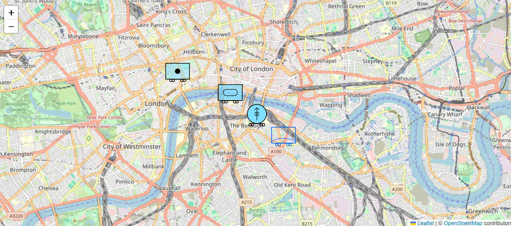

# react-leaflet-milsymbol


A React Leaflet v4 integration for the milsymbol library, allowing you to easily add military symbols to your React Leaflet maps.

**[Live Demo](https://jacorbello.github.io/react-leaflet-milsymbol/)**



## Installation

```bash
npm install react-leaflet-milsymbol
# or
yarn add react-leaflet-milsymbol
# or
pnpm add react-leaflet-milsymbol
```

> [!IMPORTANT]
> If using React 19, you will need to add the `--legacy-peer-deps` flag, as `react-leaflet` only supports React `^18.0.0`

### Dependencies

This package requires the following peer dependencies:

- `react` (v18.0.0 or v19.0.0)
- `react-dom` (v18.0.0 or v19.0.0)
- `leaflet` (v1.9.0 or higher)
- `react-leaflet` (v4.0.0 or higher)
- `milsymbol` (v3.0.0 or higher)

Make sure to install these dependencies in your project if you haven't already.

## SIDC Formats

The `sidc` prop accepts Symbol Identification Codes in both letter-based (APP-6B/C) and numeric (APP-6D) formats. Both are passed directly to milsymbol.

| Format | Length | Example | Description |
| ------ | ------ | ------- | ----------- |
| Letter-based (APP-6B/C) | 12–15 characters | `SFGPEWRH--MT` | Traditional format using letters to encode affiliation, dimension, function, etc. |
| Numeric (APP-6D) | 20 digits | `10031000001211000000` | Newer standard using numeric fields for symbol set, entity, and modifiers |

For more details on constructing SIDCs, see the [milsymbol documentation](https://www.spatialillusions.com/milsymbol/documentation.html).

## Usage

### Basic Example (Letter-based SIDC)

```jsx
import { MapContainer, TileLayer } from 'react-leaflet';
import { MilSymbol } from 'react-leaflet-milsymbol';

function MyMap() {
  return (
    <MapContainer center={[51.505, -0.09]} zoom={13} style={{ height: '500px', width: '100%' }}>
      <TileLayer
        url="https://{s}.tile.openstreetmap.org/{z}/{x}/{y}.png"
        attribution='&copy; <a href="https://www.openstreetmap.org/copyright">OpenStreetMap</a> contributors'
      />

      <MilSymbol
        position={[51.505, -0.09]}
        sidc="SFGPEWRH--MT"
        options={{
          size: 35,
          fill: true,
          fillOpacity: 0.5,
        }}
      />
    </MapContainer>
  );
}
```

### Basic Example (Numeric SIDC)

```jsx
<MilSymbol
  position={[51.505, -0.09]}
  sidc="10031000001211000000"
  options={{ size: 35 }}
/>
```

### Props

The `MilSymbol` component accepts the following props:

| Prop             | Type                    | Description                                              |
| ---------------- | ----------------------- | -------------------------------------------------------- |
| `position`       | `[number, number]`      | Latitude and longitude where the symbol should be placed |
| `sidc`           | `string`                | Symbol Identification Code (letter-based or numeric)     |
| `size`           | `number`                | Size of the symbol (default: 35)                         |
| `options`        | `object`                | Additional options to customize the symbol (see below)   |
| `tooltipContent` | `string` or `ReactNode` | Optional content for tooltip                             |
| `popupContent`   | `string` or `ReactNode` | Optional content for popup                               |
| `eventHandlers`  | `object`                | Leaflet event handlers for the marker                    |

#### Options Object

The options object can include any properties available in the milsymbol library, such as:

```javascript
{
  size: 35,              // Size of the symbol
  fill: true,            // Fill the symbol with color
  fillOpacity: 0.5,      // Opacity of the fill
  strokeWidth: 2,        // Width of the outline stroke
  outlineColor: "rgb(0, 0, 0)",  // Color of the outline
  outlineWidth: 3,       // Width of the symbol outline
  icon: true,            // Show the icon
  monoColor: false,      // Use monochrome color
  civilianColor: false,  // Use civilian colors for the symbol
  colorMode: "Light",    // "Light", "Medium", "Dark"
  infoColor: "rgb(70, 70, 70)",  // Color for information fields
  infoSize: 10,          // Size of information fields
  alternateMedal: false, // Use alternate medal
}
```

### Advanced Usage

#### Custom Symbol Styling

```jsx
<MilSymbol
  position={[51.505, -0.09]}
  sidc="SFGPEWRH--MT"
  options={{
    size: 40,
    fill: true,
    fillOpacity: 0.7,
    colorMode: "Dark",
    monoColor: "rgb(255, 0, 0)",
    infoFields: false,
  }}
/>
```

#### With Popup and Tooltip

```jsx
<MilSymbol
  position={[51.505, -0.09]}
  sidc="10031000001211000000"
  tooltipContent="Infantry Unit"
  popupContent={
    <div>
      <h3>Infantry Unit</h3>
      <p>Unit ID: 12345</p>
      <p>Status: Active</p>
    </div>
  }
/>
```

#### With Event Handlers

```jsx
<MilSymbol
  position={[51.505, -0.09]}
  sidc="SFGPEWRH--MT"
  eventHandlers={{
    click: () => {
      console.log('Symbol clicked!');
    },
    mouseover: () => {
      console.log('Mouse over symbol');
    },
  }}
/>
```

## API Reference

### Components

#### `<MilSymbol />`

The main component for adding military symbols to your React Leaflet map.

### Hooks

#### `useMilSymbol(sidc, options)`

A hook for creating milsymbol instances outside of the component. Accepts both letter-based and numeric SIDCs.

```jsx
import { useMilSymbol } from 'react-leaflet-milsymbol';

function SymbolPreview() {
  const symbol = useMilSymbol("10031000001211000000", { size: 30 });

  return (
    <div>
      <h3>Symbol Preview</h3>
      <div dangerouslySetInnerHTML={{ __html: symbol.toSVG() }} />
    </div>
  );
}
```

## Demo

A live demo is available at **[jacorbello.github.io/react-leaflet-milsymbol](https://jacorbello.github.io/react-leaflet-milsymbol/)** showing various military symbols on a Leaflet map.

To run the demo locally:

```bash
git clone https://github.com/jacorbello/react-leaflet-milsymbol.git
cd react-leaflet-milsymbol
npm install
npm run dev
```

## Contributing

Contributions are welcome! Please feel free to submit a Pull Request.

1. Fork the repository
2. Create your feature branch (`git checkout -b feature/amazing-feature`)
3. Commit your changes (`git commit -m 'Add some amazing feature'`)
4. Push to the branch (`git push origin feature/amazing-feature`)
5. Open a Pull Request

## License

This project is licensed under the MIT License - see the LICENSE file for details.

## Acknowledgements

- [milsymbol](https://www.spatialillusions.com/milsymbol/) - The core library for generating military symbols
- [react-leaflet](https://react-leaflet.js.org/) - React components for Leaflet maps
